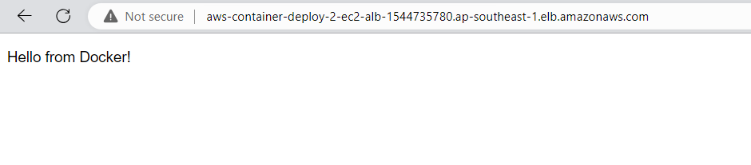

**Create EC2 instance to launch Backend app and using RDS for Postgres as Database and ALB instead of Nginx**
===


<details>
<summary>Project init</summary>

```shell
sudo apt update -y
sudo apt install jq awscli tee -y
cat <<EOF | tee ~/.aws/config
[default]
region = ap-southeast-1
output = json
EOF
cat <<EOF | tee ~/.aws/credentials
[default]
aws_access_key_id = abc
aws_secret_access_key = abc
EOF
# -> Add credential to ~/.aws/credentials file or using `aws configure` command
# project
project=aws-container-deploy-2-ec2
# global architect
region=ap-southeast-1
az_01=ap-southeast-1a
az_02=ap-southeast-1b
# tags
tags='[{"key":"purpose", "value":"test"}, {"key":"project", "value":"aws-container-deploy"}, {"key":"author", "value":"pthach"}]'
tags2='[{"Key":"purpose", "Value":"test"}, {"Key":"project", "Value":"aws-container-deploy"}, {"Key":"author", "Value":"pthach"}]'
tagspec='{Key=purpose,Value=test},{Key=project,Value=aws-container-deploy},{Key=author,Value=pthach}]'
# network
vpc_cidr=10.0.0.0/16
pubsubnet1_cidr=10.0.0.0/20
pubsubnet2_cidr=10.0.16.0/20
prisubnet1_cidr=10.0.128.0/20
prisubnet2_cidr=10.0.144.0/20
# db-password
db_password=db-abc-123
```

</details>

<details>
<summary>Create Network</summary>

```shell
# Create VPC and Enable dns-hostname feature in vpc
vpc_id=$(aws ec2 create-vpc \
    --cidr-block $vpc_cidr \
    --region $region \
    --tag-specifications `echo 'ResourceType=vpc,Tags=[{Key=Name,Value=Deploy2EC2-vpc},'$tagspec` \
    --output text \
    --query 'Vpc.VpcId')

aws ec2 modify-vpc-attribute \
    --vpc-id $vpc_id \
    --enable-dns-hostnames '{"Value": true}'

# Create subnet
subnet_public_1=$(aws ec2 create-subnet \
    --availability-zone $az_01 \
    --cidr-block $pubsubnet1_cidr \
    --tag-specifications `echo 'ResourceType=subnet,Tags=[{Key=Name,Value=Deploy2EC2-publicsubnet-'$az_01'},'$tagspec` \
    --vpc-id $vpc_id | jq -r '.Subnet.SubnetId')

subnet_public_2=$(aws ec2 create-subnet \
    --availability-zone $az_02 \
    --cidr-block $pubsubnet2_cidr \
    --tag-specifications `echo 'ResourceType=subnet,Tags=[{Key=Name,Value=Deploy2EC2-publicsubnet-'$az_02'},'$tagspec` \
    --vpc-id $vpc_id | jq -r '.Subnet.SubnetId')

subnet_private_1=$(aws ec2 create-subnet \
    --availability-zone $az_01 \
    --cidr-block $prisubnet1_cidr \
    --tag-specifications `echo 'ResourceType=subnet,Tags=[{Key=Name,Value=Deploy2EC2-privatesubnet-'$az_01'},'$tagspec` \
    --vpc-id $vpc_id | jq -r '.Subnet.SubnetId')

subnet_private_2=$(aws ec2 create-subnet \
    --availability-zone $az_02 \
    --cidr-block $prisubnet2_cidr \
    --tag-specifications `echo 'ResourceType=subnet,Tags=[{Key=Name,Value=Deploy2EC2-privatesubnet-'$az_02'},'$tagspec` \
    --vpc-id $vpc_id | jq -r '.Subnet.SubnetId')

# Create Internet Gateway
gateway_id=$(aws ec2 create-internet-gateway \
    --region $region \
    --tag-specifications `echo 'ResourceType=internet-gateway,Tags=[{Key=Name,Value=Deploy2EC2-igw},'$tagspec` \
    --output text \
    --query 'InternetGateway.InternetGatewayId')

aws ec2 attach-internet-gateway \
    --vpc-id $vpc_id \
    --internet-gateway-id $gateway_id

public_route_table_id=$(aws ec2 create-route-table \
    --tag-specifications `echo 'ResourceType=route-table,Tags=[{Key=Name,Value=Deploy2EC2-rtb},'$tagspec` \
    --vpc-id $vpc_id | jq -r '.RouteTable.RouteTableId')

aws ec2 create-route \
    --route-table-id $public_route_table_id \
    --destination-cidr-block 0.0.0.0/0 \
    --gateway-id $gateway_id

# Associate each public subnet with the public route table
aws ec2 associate-route-table \
    --subnet-id $subnet_public_1 \
    --route-table-id $public_route_table_id

aws ec2 associate-route-table \
    --subnet-id $subnet_public_2 \
    --route-table-id $public_route_table_id
```

</details>

<details>
<summary>Create RDS</summary>

```shell
# Create Subnet group
subnet_group_name=$(echo $project'-subnet-group')
aws rds create-db-subnet-group \
    --db-subnet-group-name $subnet_group_name \
    --db-subnet-group-description "Subnet Group for Postgres RDS" \
    --subnet-ids $subnet_private_1 $subnet_private_2 \
    --tags "$tags2"
# Create Security Group
rds_sgr_id=$(aws ec2 create-security-group \
    --group-name `echo $project`-rds-sgr \
    --description "Security group for RDS" \
    --tag-specifications `echo 'ResourceType=security-group,Tags=['$tagspec` \
    --vpc-id $vpc_id | jq -r '.GroupId')
aws ec2 authorize-security-group-ingress \
    --group-id $rds_sgr_id \
    --protocol tcp \
    --port 5432 \
    --cidr 0.0.0.0/0

db_name=$(echo $project'-rds')
aws rds create-db-instance \
    --db-instance-identifier $db_name \
    --engine postgres \
    --db-name example \
    --db-instance-class db.t3.micro \
    --allocated-storage 20 \
    --master-username postgres \
    --master-user-password $db_password \
    --storage-type gp2 \
    --no-enable-performance-insights \
    --availability-zone $az_01 \
    --db-subnet-group-name $subnet_group_name \
    --vpc-security-group-ids $rds_sgr_id \
    --backup-retention-period 0 \
    --tags "$tags2"

aws rds wait db-instance-available \
    --db-instance-identifier $db_name

rds_address=$(aws rds describe-db-instances \
    --db-instance-identifier $db_name \
    --query 'DBInstances[0].Endpoint.Address' \
    --output text)
```

</details>

<details>
<summary>Create EC2</summary>

## Create Keypair
```shell
key_name=$(echo $project'-keypair')
# Create Keypair
aws ec2 create-key-pair \
    --key-name $key_name \
    --region $region \
    --tag-specifications `echo 'ResourceType=key-pair,Tags=['$tagspec` \
    --query 'KeyMaterial' \
    --output text > ./$key_name.pem
```

## Create Security Group
```shell
security_group_id=$(aws ec2 create-security-group \
    --group-name `echo $project'-sgr'` \
    --description "Security group for EC2" \
    --tag-specifications `echo 'ResourceType=security-group,Tags=['$tagspec` \
    --vpc-id $vpc_id | jq -r '.GroupId')

aws ec2 authorize-security-group-ingress \
   --group-id $security_group_id \
   --protocol tcp \
   --port 22 \
   --cidr 0.0.0.0/0

aws ec2 authorize-security-group-ingress \
   --group-id $security_group_id \
   --protocol tcp \
   --port 8080 \
   --cidr 0.0.0.0/0
```

## Create EC2
```shell
ec2_ami=$(aws ec2 describe-images \
    --owners amazon \
    --filters "Name=name,Values=ubuntu/images/hvm-ssd/ubuntu-jammy-22*amd64*" "Name=state,Values=available" \
    --query 'Images[*].[ImageId]' --output text | head -n 1)

ec2_instance_id=$(aws ec2 run-instances \
    --image-id $ec2_ami \
    --count 1 \
    --instance-type t3.medium \
    --subnet-id $subnet_public_1 \
    --key-name $key_name \
    --security-group-ids $security_group_id \
    --associate-public-ip-address \
    --tag-specifications `echo 'ResourceType=instance,Tags=[{Key=Name,Value=Deploy2EC2-instance},'$tagspec` | jq -r '.Instances[0].InstanceId')
```

## Install Package and Config
```shell
ec2_public_ip=$(aws ec2 describe-instances \
    --instance-ids $ec2_instance_id \
    --query 'Reservations[].Instances[].[PublicIpAddress]' \
    --output text)
chmod 400 $key_name.pem
ssh -i $key_name.pem ubuntu@$ec2_public_ip "sudo apt update -y"
ssh -i $key_name.pem ubuntu@$ec2_public_ip "sudo apt install -y docker docker.io"
ssh -i $key_name.pem ubuntu@$ec2_public_ip "sudo groupadd docker"
ssh -i $key_name.pem ubuntu@$ec2_public_ip "sudo usermod -aG docker $USER"
```

## `docker-compose up`
```shell
ssh -i $key_name.pem ubuntu@$ec2_public_ip "mkdir ~/src"
scp -i $key_name.pem -r ../src/backend/* ubuntu@$ec2_public_ip:~/src/
ssh -i $key_name.pem ubuntu@$ec2_public_ip "cd ~/src && sudo docker build -t container-image . && sudo docker run -dp 8080:8080 --name backend --restart always -e POSTGRES_HOST=$rds_address -e POSTGRES_DB=example -e POSTGRES_PASSWORD=$db_password container-image"

# psql -h (rds_dns_name) -p 5432 -U postgres
# docker build container-image .
# docker run -dp 8080:8080\
#     --name backend \
#     --restart always \
#     -e POSTGRES_HOST=database \
#     -e POSTGRES_DB=example \
#     -e POSTGRES_PASSWORD=$db_password \
#     container-image
```

</details>

<details>
<summary>Create ALB</summary>

```shell
# Create security group
alb_sgr_id=$(aws ec2 create-security-group \
    --group-name `echo $project'-alb-sgr'` \
    --description "Security group for ALB" \
    --tag-specifications `echo 'ResourceType=security-group,Tags=['$tagspec` \
    --vpc-id $vpc_id | jq -r '.GroupId')

aws ec2 authorize-security-group-ingress \
   --group-id $alb_sgr_id \
   --protocol tcp \
   --port 22 \
   --cidr 0.0.0.0/0

aws ec2 authorize-security-group-ingress \
   --group-id $alb_sgr_id \
   --protocol tcp \
   --port 80 \
   --cidr 0.0.0.0/0
# Create ALB
alb_name=$(echo $project-alb)
alb_arn=$(aws elbv2 create-load-balancer \
    --name $alb_name  \
    --subnets $subnet_public_1 $subnet_public_2 \
    --security-groups $alb_sgr_id \
    --tags "$tags2" \
    --query 'LoadBalancers[0].LoadBalancerArn' \
    --output text)
echo $alb_arn

alb_tgr_name=$(echo $project-tgr)
alb_tgr_arn=$(aws elbv2 create-target-group \
    --name $alb_tgr_name \
    --protocol HTTP \
    --port 8080 \
    --vpc-id $vpc_id \
    --tags "$tags2" \
    --query 'TargetGroups[0].TargetGroupArn' \
    --output text)
echo $alb_tgr_arn

aws elbv2 register-targets \
    --target-group-arn $alb_tgr_arn  \
    --targets Id=$ec2_instance_id

alb_listener_arn=$(aws elbv2 create-listener \
  --load-balancer-arn $alb_arn \
  --protocol HTTP \
  --port 80 \
  --default-actions Type=forward,TargetGroupArn=$alb_tgr_arn \
  --query 'Listeners[0].ListenerArn' \
  --output text)

aws elbv2 describe-target-health --target-group-arn $alb_tgr_arn
```

</details>

<details>
<summary>Check correct</summary>

```shell
aws elbv2 describe-load-balancers \
    --load-balancer-arns $alb_arn \
    --query 'LoadBalancers[0].DNSName' \
    --output text
```



</details>

<details>
<summary>Clean</summary>

```shell
aws elbv2 delete-listener --listener-arn $alb_listener_arn
aws elbv2 delete-target-group --target-group-arn $alb_tgr_arn
aws elbv2 delete-load-balancer --load-balancer-arn $alb_arn
aws ec2 delete-security-group --group-id $alb_sgr_id
aws ec2 terminate-instances --instance-ids $ec2_instance_id
aws ec2 delete-key-pair --key-name $key_name
rm -f $key_name
aws rds delete-db-instance --db-instance-identifier $db_name --skip-final-snapshot
aws ec2 delete-security-group --group-id $rds_sgr_id
aws rds delete-db-subnet-group --db-subnet-group-name $subnet_group_name
aws ec2 delete-security-group --group-id $security_group_id
aws ec2 delete-subnet --subnet-id $subnet_public_1
aws ec2 delete-subnet --subnet-id $subnet_public_2
aws ec2 delete-subnet --subnet-id $subnet_private_1
aws ec2 delete-subnet --subnet-id $subnet_private_2
aws ec2 delete-route-table --route-table-id $public_route_table_id
aws ec2 detach-internet-gateway --internet-gateway-id $gateway_id --vpc-id $vpc_id
aws ec2 delete-internet-gateway --internet-gateway-id $gateway_id
aws ec2 delete-vpc --vpc-id $vpc_id
```

</details>