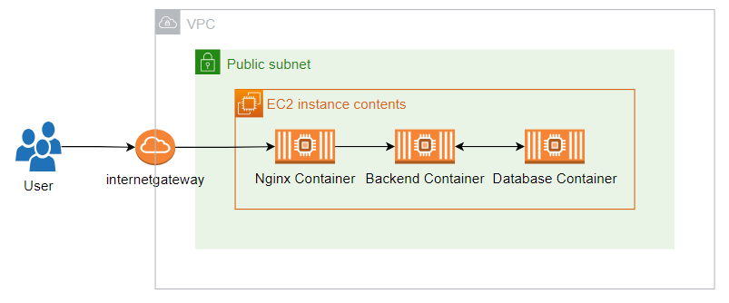
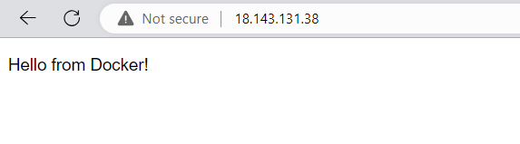
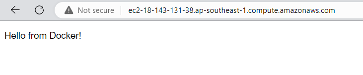

**Deploy Docker container to AWS EC2 step by step**
===



The system is deployed using AWS CLI and divided into several stages:
- Setting up environment variables and configuring AWS CLI.
- Creating Network:
    - Creating VPC.
    - Creating Subnet.
    - Creating Internet Gateway.
    - Creating Route table and configuring routing.
- Launching EC2 Instance.
    - Generating EC2 Key Pair.
    - Creating Security Group.
    - Launching EC2 Instance.
    - Configuring the EC2 Instance and running docker-compose.
- Verifying Results.
- Cleaning up the System.

Main components of the system are an EC2 instance deployed in a public subnet, which can be accessed directly through port 80. The traffic is then forwarded sequentially through an Nginx container, backend container, and database container.

The application is managed and deployed using Docker-compose, consisting of:
- Nginx container: work as a proxy server.
- Backend container: serves as the application server to handle user requests.
- Database container: using Postgres Database.

For more details on the docker-compose file, please refer to this [link](../docker-compose/README.md)

<details>
<summary>Environment init</summary>

```shell
sudo apt update -y
sudo apt install jq awscli tee -y
cat <<EOF | tee ~/.aws/config
[default]
region = ap-southeast-1
output = json
EOF
# project
project=aws-container-deploy-2-ec2
# global architect
region=ap-southeast-1
az=ap-southeast-1a
# tags
tags='[{"key":"purpose", "value":"test"}, {"key":"project", "value":"aws-container-deploy"}, {"key":"author", "value":"pthach"}]'
tags2='[{"Key":"purpose", "Value":"test"}, {"Key":"project", "Value":"aws-container-deploy"}, {"Key":"author", "Value":"pthach"}]'
tagspec='{Key=purpose,Value=test},{Key=project,Value=aws-container-deploy},{Key=author,Value=pthach}]'
# muốn ngầu thì dùng cái này thay cho tagspec ở trên
# tagspec=$(echo "ResourceType=vpc,Tags="$(echo "$tags2" | jq --argjson new_tag '{"Key": "Name", "Value": "Deploy2EC2-vpc"}' '. + [$new_tag]' | tr -d " \t\n\r" | sed 's/\"//g' | sed 's/\:/\=/g'))
# -> ResourceType=vpc,Tags=[{Key=purpose,Value=test},{Key=project,Value=aws-container-deploy},{Key=author,Value=pthach},{Key=Name,Value=Deploy2EC2-vpc}]
# network
vpc_cidr=10.0.0.0/16
pubsubnet_cidr=10.0.0.0/20
```

</details>
<details>
<summary>Create Network</summary>

## Create VPC
```shell
# Create VPC and Enable dns-hostname feature in vpc
vpc_id=$(aws ec2 create-vpc \
    --cidr-block $vpc_cidr \
    --region $region \
    --tag-specifications `echo 'ResourceType=vpc,Tags=[{Key=Name,Value=Deploy2EC2-vpc},'$tagspec` \
    --output text \
    --query 'Vpc.VpcId')

aws ec2 modify-vpc-attribute \
    --vpc-id $vpc_id \
    --enable-dns-hostnames '{"Value": true}'
```

## Create Subnet
```shell
# Create subnet
subnet_id=$(aws ec2 create-subnet \
    --availability-zone $az \
    --cidr-block $pubsubnet_cidr \
    --tag-specifications `echo 'ResourceType=subnet,Tags=[{Key=Name,Value=Deploy2EC2-subnet},'$tagspec` \
    --vpc-id $vpc_id | jq -r '.Subnet.SubnetId')
```

## Create Internet Gateway
```shell
# Create Internet Gateway
gateway_id=$(aws ec2 create-internet-gateway \
    --region $region \
    --tag-specifications `echo 'ResourceType=internet-gateway,Tags=[{Key=Name,Value=Deploy2EC2-igw},'$tagspec` \
    --output text \
    --query 'InternetGateway.InternetGatewayId')

aws ec2 attach-internet-gateway \
    --vpc-id $vpc_id \
    --internet-gateway-id $gateway_id
```

## Routing
```shell
route_table_id=$(aws ec2 create-route-table \
    --tag-specifications `echo 'ResourceType=route-table,Tags=[{Key=Name,Value=Deploy2EC2-rtb},'$tagspec` \
    --vpc-id $vpc_id | jq -r '.RouteTable.RouteTableId')

aws ec2 create-route \
    --route-table-id $route_table_id \
    --destination-cidr-block 0.0.0.0/0 \
    --gateway-id $gateway_id

aws ec2 associate-route-table \
    --subnet-id $subnet_id \
    --route-table-id $route_table_id
```

</details>
<details>
<summary>Create EC2</summary>

## Create Keypair
```shell
key_name=$(echo $project'-keypair')
# Create Keypair
aws ec2 create-key-pair \
    --key-name $key_name \
    --region $region \
    --tag-specifications `echo 'ResourceType=key-pair,Tags=['$tagspec` \
    --query 'KeyMaterial' \
    --output text > ./$key_name.pem
```

## Create Security Group
```shell
security_group_id=$(aws ec2 create-security-group \
    --group-name `echo $project'-sgr'` \
    --description "Security group for EC2" \
    --tag-specifications `echo 'ResourceType=security-group,Tags=['$tagspec` \
    --vpc-id $vpc_id | jq -r '.GroupId')

aws ec2 authorize-security-group-ingress \
   --group-id $security_group_id \
   --protocol tcp \
   --port 22 \
   --cidr 0.0.0.0/0

aws ec2 authorize-security-group-ingress \
   --group-id $security_group_id \
   --protocol tcp \
   --port 80 \
   --cidr 0.0.0.0/0
```

## Create EC2
```shell
ec2_ami=$(aws ec2 describe-images \
    --owners amazon \
    --filters "Name=name,Values=ubuntu/images/hvm-ssd/ubuntu-focal-20*" "Name=state,Values=available" \
    --query 'Images[*].[ImageId]' --output text | head -n 1)

ec2_instance_id=$(aws ec2 run-instances \
    --image-id $ec2_ami \
    --count 1 \
    --instance-type t3.medium \
    --subnet-id $subnet_id \
    --key-name $key_name \
    --security-group-ids $security_group_id \
    --associate-public-ip-address \
    --tag-specifications `echo 'ResourceType=instance,Tags=[{Key=Name,Value=Deploy2EC2-instance},'$tagspec` | jq -r '.Instances[0].InstanceId')
```

## Install Package and Config
```shell
ec2_public_ip=$(aws ec2 describe-instances \
    --instance-ids $ec2_instance_id \
    --query 'Reservations[].Instances[].[PublicIpAddress]' \
    --output text)
chmod 400 $key_name.pem
ssh -i $key_name.pem ubuntu@$ec2_public_ip "sudo apt update -y"
ssh -i $key_name.pem ubuntu@$ec2_public_ip "sudo apt install -y docker docker-compose"
ssh -i $key_name.pem ubuntu@$ec2_public_ip "sudo groupadd docker"
ssh -i $key_name.pem ubuntu@$ec2_public_ip "sudo usermod -aG docker $USER"

# ssh -i $key_name.pem ubuntu@$ec2_public_ip "sudo apt install -y apache2"
# ssh -i $key_name.pem ubuntu@$ec2_public_ip "sudo touch /etc/apache2/sites-available/site.conf"

# cat <<EOF | ssh -i $key_name.pem ubuntu@$ec2_public_ip "cat > site.conf && sudo mv site.conf /etc/apache2/sites-available/site.conf"
# <VirtualHost *:80>
#   ServerName docker.com
#   <Location />
#     Order allow,deny
#     Allow from all
#     Require all granted
#   </Location>
#   ProxyPass /           http://127.0.0.1:8080/
#   ProxyPassReverse /        http://127.0.0.1:8080/
# </VirtualHost>
# EOF

# ssh -i $key_name.pem ubuntu@$ec2_public_ip "sudo a2dissite 000-default.conf"
# ssh -i $key_name.pem ubuntu@$ec2_public_ip "sudo a2ensite site.conf"
# ssh -i $key_name.pem ubuntu@$ec2_public_ip "sudo a2enmod proxy proxy_http"
# ssh -i $key_name.pem ubuntu@$ec2_public_ip "sudo systemctl reload apache2"
# ssh -i $key_name.pem ubuntu@$ec2_public_ip "sudo systemctl restart apache2"
```

## `docker-compose up`
```shell
ssh -i $key_name.pem ubuntu@$ec2_public_ip "mkdir ~/docker-compose"
scp -i $key_name.pem -r ../docker-compose/* ubuntu@$ec2_public_ip:~/docker-compose/
ssh -i $key_name.pem ubuntu@$ec2_public_ip "mkdir ~/src"
scp -i $key_name.pem -r ../src/* ubuntu@$ec2_public_ip:~/src/
ssh -i $key_name.pem ubuntu@$ec2_public_ip "cd ~/docker-compose && sudo docker-compose up -d"
```

</details>
<details>
<summary>Access to api using IP, EC2 DNS</summary>

## Public IP of EC2
```shell
echo $ec2_public_ip
```



## Public DNS of EC2
```shell
aws ec2 describe-instances \
    --instance-ids $ec2_instance_id \
    --query 'Reservations[].Instances[].[PublicDnsName]' \
    --output text
```



</details>
<details>
<summary>Clean</summary>

```shell
aws ec2 terminate-instances --instance-ids $ec2_instance_id
aws ec2 delete-key-pair --key-name $key_name
aws ec2 delete-security-group --group-id $security_group_id
aws ec2 delete-subnet --subnet-id $subnet_id
aws ec2 delete-route-table --route-table-id $route_table_id
aws ec2 detach-internet-gateway --internet-gateway-id $gateway_id --vpc-id $vpc_id
aws ec2 delete-internet-gateway --internet-gateway-id $gateway_id
aws ec2 delete-vpc --vpc-id $vpc_id
rm -f $key_name.pem
```

</details>