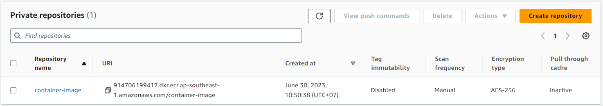
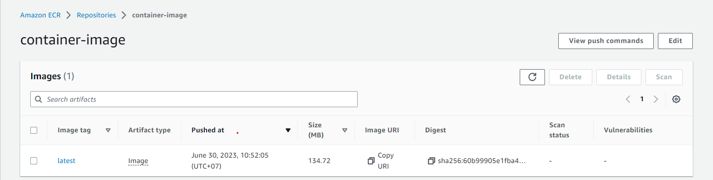

**Create ECR repository for Backend app and Nginx app**
=======================================================

# Project init

```shell
sudo apt update -y
sudo apt install jq awscli tee -y
cat <<EOF | tee ~/.aws/config
[default]
region = ap-southeast-1
output = json
EOF
cat <<EOF | tee ~/.aws/credentials
[default]
aws_access_key_id = abc
aws_secret_access_key = abc
EOF
# -> Add credential to ~/.aws/credentials file or using `aws configure` command
# global architect
region=ap-southeast-1
# tags
tags='[{"Key":"purpose", "Value":"test"}, {"Key":"project", "Value":"aws-container-deploy"}, {"Key":"author", "Value":"pthach"}]'
# AWS Account ID
aws_account_id=$(aws sts get-caller-identity --query 'Account' --output text)
# Private ECR repository
aws ecr get-login-password --region $region | docker login --username AWS --password-stdin `aws sts get-caller-identity --query 'Account' --output text`.dkr.ecr.$region.amazonaws.com
# Public ecr
aws ecr-public get-login-password --region $region | docker login --username AWS --password-stdin public.ecr.aws/ecr_id`
# -> Docker Credential will save to ~/.docker/config.json file
```

# Create ECR Repository
## Create Repository
```shell
name=container-image
aws ecr create-repository \
        --repository-name $name \
        --region $region \
        --tags "$tags"
```
> ECR repository created
> 

## Create Docker image from Dockerfile and push to ECR
```shell
docker build -t $name .
# check Docker image created correctly
docker images --filter reference=$name
# Tag the image to push to your repository.
docker tag $name:latest $aws_account_id.dkr.ecr.$region.amazonaws.com/$name
# Push to AWS
docker push $aws_account_id.dkr.ecr.$region.amazonaws.com/$name
```
> Push image to AWS ECR success


## Pull image from ECR
```shell
docker pull $aws_account_id.dkr.ecr.$region.amazonaws.com/$name:latest
```

## Delete image in ECR
```shell
aws ecr batch-delete-image \
      --repository-name $name \
      --image-ids imageTag=latest \
      --region $region
```

## Delete Repository
```shell
aws ecr delete-repository \
    --repository-name $name \
    --force \
    --region $region
```