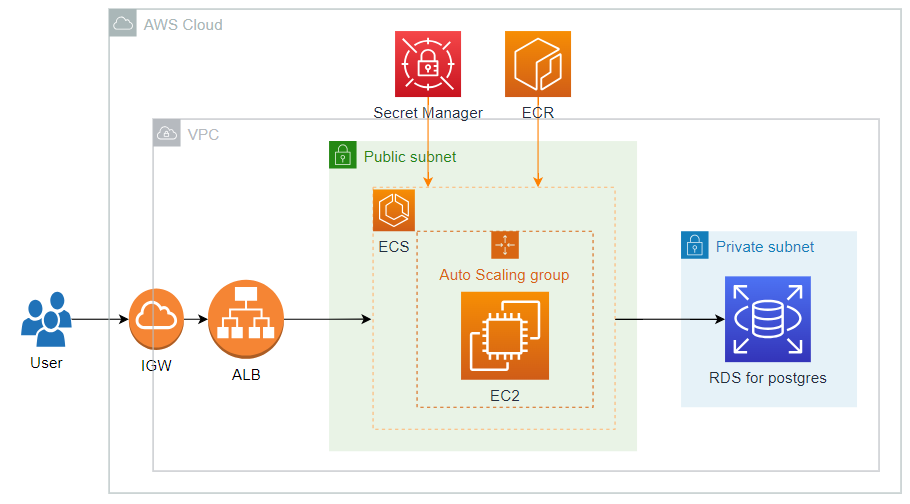

**Deploy Container into ECS and using ALB to redirect connection, and RDS as Database Server**
===



The AWS system created using the AWS Command Line Interface (CLI) includes an Application Load Balancer (ALB), Amazon ECS with EC2 instances deployed using an Auto Scaling group, AWS Secrets Manager to securely store database information, and Amazon RDS for PostgreSQL.

The system is deployed using AWS CLI and divided into several stages:
- [Project init](#project-init)
  * [AWS config](#aws-config)
  * [Shell Variable](#shell-variable)
- [Create Network](#create-network)
  * [Create VPC](#create-vpc)
  * [Create Subnet](#create-subnet)
  * [Create Internet Gateway](#create-internet-gateway)
  * [Create Routetable and Routing](#create-routetable-and-routing)
- [Create RDS](#create-rds)
  * [Create Subnet Group](#create-subnet-group)
  * [Create Security group](#create-security-group)
  * [Create RDS](#create-rds-1)
- [Create Secret Manager](#create-secret-manager)
- [Create ECS](#create-ecs)
  * [Create ECS Cluster](#create-ecs-cluster)
  * [Prepare to create EC2](#prepare-to-create-ec2)
  * [Create auto scaling group](#create-auto-scaling-group)
  * [Create EC2](#create-ec2)
  * [Create Task Definition](#create-task-definition)
  * [Create Service](#create-service)
- [Create ALB](#create-alb)
  * [Create Security Group for ALB](#create-security-group-for-alb)
  * [Create ALB](#create-alb-1)
  * [Update the ECS service to use your ALB](#update-the-ecs-service-to-use-your-alb)
- [Check correct](#check-correct)
  * [Get ALB public DNS](#get-alb-public-dns)
- [Clean](#clean)
  * [ALB](#alb)
  * [ECS EC2](#ecs-ec2)
  * [RDS](#rds)
  * [ECS](#ecs)
  * [Secret Manager](#secret-manager)
  * [Network](#network)
  * [ECR](#ecr)

# Project init

<details>
<summary>AWS config</summary>

## AWS config
```shell
sudo apt update -y
sudo apt install jq awscli -y
cat <<EOF | tee ~/.aws/config
[default]
region = ap-southeast-1
output = json
EOF
cat <<EOF | tee ~/.aws/credentials
[default]
aws_access_key_id = abc
aws_secret_access_key = abc
EOF
# -> Add credential to ~/.aws/credentials file or using `aws configure` command
```
</details>

<details>
<summary>Shell Variable</summary>

## Shell Variable
```shell
# project
project=aws-container-deploy-2-ecs
project2=Deploy2ECS
# global architect
region=ap-southeast-1
az_01=ap-southeast-1a
az_02=ap-southeast-1b
az_03=ap-southeast-1c
# tags
tags='[{"key":"purpose", "value":"test"}, {"key":"project", "value":"aws-container-deploy"}, {"key":"author", "value":"pthach"}]'
tags2='[{"Key":"purpose", "Value":"test"}, {"Key":"project", "Value":"aws-container-deploy"}, {"Key":"author", "Value":"pthach"}]'
tagspec='{Key=purpose,Value=test},{Key=project,Value=aws-container-deploy},{Key=author,Value=pthach}]'
# Identity
aws_account_id=$(aws sts get-caller-identity --query 'Account' --output text)
ecs_task_backend_image=$aws_account_id.dkr.ecr.$region.amazonaws.com/backend-container:latest
# network
vpc_cidr=10.1.0.0/16
pubsubnet1_cidr=10.1.0.0/20
pubsubnet2_cidr=10.1.16.0/20
pubsubnet3_cidr=10.1.32.0/20
prisubnet1_cidr=10.1.128.0/20
prisubnet2_cidr=10.1.144.0/20
prisubnet3_cidr=10.1.160.0/20
```
</details>

# Create Network

<details>
<summary>Create VPC</summary>

## Create VPC
```shell
vpc_name=$project2-vpc
# Create VPC and Enable dns-hostname feature in vpc
vpc_id=$(aws ec2 create-vpc \
    --cidr-block $vpc_cidr \
    --region $region \
    --tag-specifications `echo 'ResourceType=vpc,Tags=[{Key=Name,Value='$vpc_name'},'$tagspec` \
    --output text \
    --query 'Vpc.VpcId')

aws ec2 modify-vpc-attribute \
    --vpc-id $vpc_id \
    --enable-dns-hostnames '{"Value": true}'

echo $vpc_id
```
</details>

<details>
<summary>Create Subnet</summary>

## Create Subnet
```shell
pubsubnet1_name=$project2-pubsubnet-$az_01
pubsubnet2_name=$project2-pubsubnet-$az_02
pubsubnet3_name=$project2-pubsubnet-$az_03
prisubnet1_name=$project2-prisubnet-$az_01
prisubnet2_name=$project2-prisubnet-$az_02
prisubnet3_name=$project2-prisubnet-$az_03
# Create subnet
subnet_public_1=$(aws ec2 create-subnet \
    --availability-zone $az_01 \
    --cidr-block $pubsubnet1_cidr \
    --tag-specifications `echo 'ResourceType=subnet,Tags=[{Key=Name,Value='$pubsubnet1_name'},'$tagspec` \
    --vpc-id $vpc_id | jq -r '.Subnet.SubnetId')

subnet_public_2=$(aws ec2 create-subnet \
    --availability-zone $az_02 \
    --cidr-block $pubsubnet2_cidr \
    --tag-specifications `echo 'ResourceType=subnet,Tags=[{Key=Name,Value='$pubsubnet2_name'},'$tagspec` \
    --vpc-id $vpc_id | jq -r '.Subnet.SubnetId')

subnet_public_3=$(aws ec2 create-subnet \
    --availability-zone $az_03 \
    --cidr-block $pubsubnet3_cidr \
    --tag-specifications `echo 'ResourceType=subnet,Tags=[{Key=Name,Value='$pubsubnet3_name'},'$tagspec` \
    --vpc-id $vpc_id | jq -r '.Subnet.SubnetId')

subnet_private_1=$(aws ec2 create-subnet \
    --availability-zone $az_01 \
    --cidr-block $prisubnet1_cidr \
    --tag-specifications `echo 'ResourceType=subnet,Tags=[{Key=Name,Value='$prisubnet1_name'},'$tagspec` \
    --vpc-id $vpc_id | jq -r '.Subnet.SubnetId')

subnet_private_2=$(aws ec2 create-subnet \
    --availability-zone $az_02 \
    --cidr-block $prisubnet2_cidr \
    --tag-specifications `echo 'ResourceType=subnet,Tags=[{Key=Name,Value='$prisubnet2_name'},'$tagspec` \
    --vpc-id $vpc_id | jq -r '.Subnet.SubnetId')

subnet_private_3=$(aws ec2 create-subnet \
    --availability-zone $az_03 \
    --cidr-block $prisubnet3_cidr \
    --tag-specifications `echo 'ResourceType=subnet,Tags=[{Key=Name,Value='$prisubnet3_name'},'$tagspec` \
    --vpc-id $vpc_id | jq -r '.Subnet.SubnetId')

echo $subnet_public_1
echo $subnet_public_2
echo $subnet_public_3
echo $subnet_private_1
echo $subnet_private_2
echo $subnet_private_3
```
</details>

<details>
<summary>Create Internet Gateway</summary>

## Create Internet Gateway
```shell
igw_name=$project2-igw
# Create Internet Gateway
gateway_id=$(aws ec2 create-internet-gateway \
    --region $region \
    --tag-specifications `echo 'ResourceType=internet-gateway,Tags=[{Key=Name,Value='$igw_name'},'$tagspec` \
    --output text \
    --query 'InternetGateway.InternetGatewayId')

aws ec2 attach-internet-gateway \
    --vpc-id $vpc_id \
    --internet-gateway-id $gateway_id

echo $gateway_id
```
</details>

<details>
<summary>Create Routetable and Routing</summary>

## Create Routetable and Routing
```shell
rtb_name=$project2-rtb
# Create Route table
rtb_public_id=$(aws ec2 create-route-table \
    --tag-specifications `echo 'ResourceType=route-table,Tags=[{Key=Name,Value='$rtb_name'},'$tagspec` \
    --vpc-id $vpc_id | jq -r '.RouteTable.RouteTableId')

aws ec2 create-route \
    --route-table-id $rtb_public_id \
    --destination-cidr-block 0.0.0.0/0 \
    --gateway-id $gateway_id

# Associate each public subnet with the public route table
aws ec2 associate-route-table \
    --subnet-id $subnet_public_1 \
    --route-table-id $rtb_public_id

aws ec2 associate-route-table \
    --subnet-id $subnet_public_2 \
    --route-table-id $rtb_public_id

aws ec2 associate-route-table \
    --subnet-id $subnet_public_3 \
    --route-table-id $rtb_public_id

echo $rtb_public_id
```
</details>

<details>
<summary>Endpoint</summary>

```shell
com.amazonaws.$region.s3
com.amazonaws.$region.ecr.dkr
com.amazonaws.$region.ecr.api
com.amazonaws.$region.ecs
com.amazonaws.$region.ecs-agent
com.amazonaws.$region.ecs-telemetry
com.amazonaws.$region.ssm
com.amazonaws.$region.secretsmanager
```
</details>

# Create RDS

<details>
<summary>Create Subnet Group</summary>

## Create Subnet Group
```shell
rds_subnet_group_name=$project2-subnet-group
rds_subnet_group_descript="Subnet Group for Postgres RDS"
rds_subnet1_id=$subnet_private_1
rds_subnet2_id=$subnet_private_2
# Create Subnet group
aws rds create-db-subnet-group \
    --db-subnet-group-name $rds_subnet_group_name \
    --db-subnet-group-description "$rds_subnet_group_descript" \
    --subnet-ids $rds_subnet1_id $rds_subnet2_id \
    --tags "$tags2"
```
</details>

<details>
<summary>Create Security group</summary>

## Create Security group
```shell
rds_sgr_name=$project2-rds-sgr
# Create Security Group
rds_sgr_id=$(aws ec2 create-security-group \
    --group-name $rds_sgr_name  \
    --description "Security group for RDS" \
    --tag-specifications `echo 'ResourceType=security-group,Tags=['$tagspec` \
    --vpc-id $vpc_id | jq -r '.GroupId')

aws ec2 authorize-security-group-ingress \
    --group-id $rds_sgr_id \
    --protocol tcp \
    --port 5432 \
    --cidr 0.0.0.0/0

echo $rds_sgr_id
```
</details>

<details>
<summary>Create RDS</summary>

## Create RDS
```shell
rds_name=$project2-rds
rds_db_name="example"
rds_db_username="postgres"
rds_db_password=$(cat db_password)
# Create RDS
aws rds create-db-instance \
    --db-instance-identifier $rds_name \
    --engine postgres \
    --db-name $rds_db_name \
    --db-instance-class db.t3.micro \
    --allocated-storage 20 \
    --master-username $rds_db_username \
    --master-user-password $rds_db_password \
    --storage-type gp2 \
    --no-enable-performance-insights \
    --availability-zone $az_01 \
    --db-subnet-group-name $rds_subnet_group_name \
    --vpc-security-group-ids $rds_sgr_id \
    --backup-retention-period 0 \
    --tags "$tags2"

aws rds wait db-instance-available \
    --db-instance-identifier $rds_name
```
</details>

# Create Secret Manager

<details>
<summary>Create Secret Manager</summary>

```shell
# Get RDS information
rds_address=$(aws rds describe-db-instances \
    --db-instance-identifier $rds_name \
    --query 'DBInstances[0].Endpoint.Address' \
    --output text)
echo $rds_address

secret_name=$project2-sm
secret_string=$(echo "{\"POSTGRES_HOST\":\"$rds_address\",\"POSTGRES_DB\":\"$rds_db_name\",\"POSTGRES_PASSWORD\":\"$rds_db_password\"}")
# Create SecretManager
aws secretsmanager create-secret \
    --name $secret_name \
    --description "To save database information" \
    --tags "$tags2" \
    --secret-string $secret_string
```
</details>

# Create ECS

<details>
<summary>Create ECS Cluster</summary>

## Create ECS Cluster
```shell
ecs_cluster_name=$project2-cluster
# Create ECS Cluster
aws ecs create-cluster \
    --cluster-name $ecs_cluster_name \
    --region $region \
    --tags "$tags"

# Check ECS Cluster created correctly
aws ecs list-clusters
```
</details>

<details>
<summary>Prepare to create EC2</summary>

## Prepare to create EC2
```shell
ecs_ec2_key_name=$(echo $project2-keypair)
ecs_ec2_sgr_name=$(echo $project2-ecs-sgr)
ecs_ec2_role_name=$(echo $project2-ecs-ec2-role)
# Create Keypair
aws ec2 create-key-pair \
    --key-name $ecs_ec2_key_name \
    --region $region \
    --tag-specifications `echo 'ResourceType=key-pair,Tags=['$tagspec` \
    --query 'KeyMaterial' \
    --output text > ./$ecs_ec2_key_name.pem

# Create Security Group
ecs_ec2_sgr_id=$(aws ec2 create-security-group \
    --group-name $ecs_ec2_sgr_name \
    --description "Security group for EC2 in ECS" \
    --tag-specifications `echo 'ResourceType=security-group,Tags=['$tagspec` \
    --vpc-id $vpc_id | jq -r '.GroupId')

aws ec2 authorize-security-group-ingress \
   --group-id $ecs_ec2_sgr_id \
   --protocol tcp \
   --port 8080 \
   --cidr 0.0.0.0/0

aws ec2 authorize-security-group-ingress \
   --group-id $ecs_ec2_sgr_id \
   --protocol tcp \
   --port 22 \
   --cidr 0.0.0.0/0

echo $ecs_ec2_sgr_id

# Create EC2 Role
aws iam create-role \
    --role-name $ecs_ec2_role_name \
    --assume-role-policy-document '{
        "Version": "2012-10-17",
        "Statement": [{
            "Effect": "Allow",
            "Principal": {
                "Service": ["ec2.amazonaws.com"]
            },
            "Action": ["sts:AssumeRole"]
        }]
    }' \
    --tags "$tags2"
    
aws iam attach-role-policy \
    --policy-arn arn:aws:iam::aws:policy/service-role/AmazonEC2ContainerServiceforEC2Role \
    --role-name $ecs_ec2_role_name

aws iam attach-role-policy \
    --policy-arn arn:aws:iam::aws:policy/AmazonSSMManagedInstanceCore \
    --role-name $ecs_ec2_role_name

aws iam create-instance-profile \
    --instance-profile-name $ecs_ec2_role_name

aws iam add-role-to-instance-profile \
    --instance-profile-name $ecs_ec2_role_name \
    --role-name $ecs_ec2_role_name

ecs_ec2_instanceprofile_arn=$(aws iam get-instance-profile \
    --instance-profile-name $ecs_ec2_role_name \
    --output text \
    --query 'InstanceProfile.Arn')

# Get ECS AMI ID
# [get ecs ami](https://docs.aws.amazon.com/AmazonECS/latest/developerguide/retrieve-ecs-optimized_AMI.html)
ecs_ec2_ami_id=$(aws ssm get-parameters \
    --names /aws/service/ecs/optimized-ami/amazon-linux-2/recommended \
    --region $region | jq -r '.Parameters[0].Value | fromjson.image_id')

echo $ecs_ec2_ami_id
```
</details>

> 👉You can using create Auto Scaling Group instead of create EC2 or only EC2 or both.  

<details>
<summary>Create auto scaling group</summary>

## Create auto scaling group
```shell
ecs_ec2_template_name=$project2-ecs-ec2-template
ecs_ec2_autoscale_name=$project2-ecs-ec2-autoscale
ecs_ec2_instancetype=t3.medium
ecs_ec2_subnet_id=$subnet_public_1
ecs_ec2_userdata=$(cat <<EOF | openssl base64 -A
#!/bin/bash\necho ECS_CLUSTER=$ecs_cluster_name >> /etc/ecs/ecs.config
EOF
)
echo -e '#!/bin/bash\necho ECS_CLUSTER=$ecs_cluster_name >> /etc/ecs/ecs.config' | base64

# Create Launch template
cat <<EOF | tee ecs-ec2-launch-template.json
{
    "ImageId": "$ecs_ec2_ami_id",
    "InstanceType": "$ecs_ec2_instancetype",
    "IamInstanceProfile": {
        "Arn": "$ecs_ec2_instanceprofile_arn"
    },
    "NetworkInterfaces": [{
        "DeviceIndex": 0,
        "AssociatePublicIpAddress": true,
        "Groups": ["$ecs_ec2_sgr_id"],
        "SubnetId": "$ecs_ec2_subnet_id"
    }],
    "KeyName": "$ecs_ec2_key_name",
    "TagSpecifications": [{
        "ResourceType": "instance",
        "Tags": `echo '['$tagspec | sed 's/{/{"/g; s/}/"}/g; s/,/","/g; s/}","{/},{/g; s/=/":"/g'`
    }],
    "UserData": "`cat <<EOF | openssl base64 -A
#!/bin/bash
echo ECS_CLUSTER=$ecs_cluster_name >> /etc/ecs/ecs.config
EOF`"
}
EOF

# "
aws ec2 create-launch-template \
    --launch-template-name $ecs_ec2_template_name \
    --launch-template-data file://ecs-ec2-launch-template.json

# create Autoscaling group
aws autoscaling create-auto-scaling-group \
    --auto-scaling-group-name $ecs_ec2_autoscale_name \
    --launch-template '{"LaunchTemplateName":"'$ecs_ec2_template_name'"}' \
    --min-size 1 \
    --max-size 3 \
    --desired-capacity 1 \
    --tags "$tags2"
```
</details>

<details>
<summary>Create EC2</summary>

## Create EC2
```shell
ecs_ec2_subnet_id=$subnet_public_1
ecs_ec2_tag=$project2-ecs-ec2
# Create EC2
cat <<EOF | tee ecs-ec2-userdata.txt
#!/bin/bash
echo ECS_CLUSTER=`echo -n $ecs_cluster_name` >> /etc/ecs/ecs.config
EOF

ecs_ec2_id=$(aws ec2 run-instances \
    --image-id $ecs_ec2_ami_id \
    --count 1 \
    --instance-type t3.medium \
    --subnet-id $ecs_ec2_subnet_id \
    --key-name $ecs_ec2_key_name \
    --security-group-ids $ecs_ec2_sgr_id \
    --associate-public-ip-address \
    --user-data  file://ecs-ec2-userdata.txt \
    --tag-specifications `echo "ResourceType=instance,Tags=["$tagspec` | jq -r '.Instances[0].InstanceId')

aws ec2 associate-iam-instance-profile \
    --instance-id $ecs_ec2_id \
    --iam-instance-profile Name=$ecs_ec2_role_name

echo $ecs_ec2_id   
```
</details>

<details>
<summary>Create Task Definition</summary>

## Create Task Definition
```shell
# Get ARN of AWS secret manager
secret_arn=$(aws secretsmanager describe-secret --secret-id $secret_name --query 'ARN' --output text)

echo $secret_arn
# Create Task Definition role
ecs_task_role_name=$(echo $project2-ecs-task-role)
ecs_task_policy_name=ecs_task_policy
ecs_task_backend_name=$project2-backend-task
ecs_task_backend_image=$aws_account_id.dkr.ecr.$region.amazonaws.com/backend-container:latest
# Create EC2 Role
ecs_task_role_arn=$(aws iam create-role \
    --role-name $ecs_task_role_name \
    --assume-role-policy-document '{
        "Version": "2012-10-17",
        "Statement": [{
            "Effect": "Allow",
            "Principal": {
                "Service": "ecs-tasks.amazonaws.com"
            },
            "Action": ["sts:AssumeRole"]
        }]
    }' \
    --tags "$tags2" \
    --output text \
    --query 'Role.Arn')

cat <<EOF | tee ecs-task-role.json
{
  "Version": "2012-10-17",
  "Statement": [
    {
      "Effect": "Allow",
      "Action": [
        "ssm:GetParameters",
        "secretsmanager:GetSecretValue"
      ],
      "Resource": [
        "`echo $secret_arn`",
        "`echo $secret_arn`*"
      ]
    }
  ]
}
EOF

aws iam put-role-policy \
    --role-name $ecs_task_role_name \
    --policy-name $ecs_task_policy_name \
    --policy-document file://ecs-task-role.json

aws iam attach-role-policy \
    --policy-arn arn:aws:iam::aws:policy/AmazonEC2ContainerRegistryReadOnly \
    --role-name $ecs_task_role_name

ecs_task_role_arn=$(aws iam get-role \
    --role-name $ecs_task_role_name \
    --output text \
    --query 'Role.Arn')

# Content of task-definition
cat <<EOF | tee backend-definition.json
{
    "name": "$ecs_task_backend_name",
    "image": "$ecs_task_backend_image",
    "portMappings": [
        {
            "containerPort": 8080,
            "hostPort": 8080
        }
    ],
    "secrets" : [
        {
            "valueFrom" : "$secret_arn:POSTGRES_HOST::",
            "name" : "POSTGRES_HOST"
        },
        {
            "valueFrom" : "$secret_arn:POSTGRES_DB::",
            "name" : "POSTGRES_DB"
        },
        {
            "valueFrom" : "$secret_arn:POSTGRES_PASSWORD::",
            "name" : "POSTGRES_PASSWORD"
        }
    ]
}
EOF
# Create task-definition
ecs_backend_task_definition=$(aws ecs register-task-definition \
    --family $ecs_task_backend_name \
    --network-mode awsvpc \
    --requires-compatibilities EC2 \
    --cpu "256" \
    --memory "512" \
    --execution-role-arn "$ecs_task_role_arn" \
    --tags "$tags" \
    --container-definitions "`jq -c . backend-definition.json`" )

# Check ECS task definition created correctly
aws ecs list-task-definitions
```
</details>

<details>
<summary>Create Service</summary>

## Create Service
```shell
ecs_service_name=backend-service
# Backend
ecs_task_arn=$(aws ecs describe-task-definition \
    --task-definition $ecs_task_backend_name \
    --query "taskDefinition.taskDefinitionArn" \
    --output text)

echo $ecs_task_arn

aws ecs create-service \
   --cluster $ecs_cluster_name \
   --service-name $ecs_service_name \
   --task-definition $ecs_task_arn \
   --desired-count 1 \
   --network-configuration "awsvpcConfiguration={subnets=[$subnet_public_1],securityGroups=[$ecs_ec2_sgr_id]}"
```
</details>

# Create ALB

<details>
<summary>Create Security Group for ALB</summary>

## Create Security Group for ALB
```shell
alb_sgr_name=$project2-alb-sgr
# Create security group
alb_sgr_id=$(aws ec2 create-security-group \
    --group-name $alb_sgr_name \
    --description "Security group for ALB" \
    --tag-specifications `echo 'ResourceType=security-group,Tags=['$tagspec` \
    --vpc-id $vpc_id | jq -r '.GroupId')

aws ec2 authorize-security-group-ingress \
   --group-id $alb_sgr_id \
   --protocol tcp \
   --port 22 \
   --cidr 0.0.0.0/0

aws ec2 authorize-security-group-ingress \
   --group-id $alb_sgr_id \
   --protocol tcp \
   --port 80 \
   --cidr 0.0.0.0/0

echo $alb_sgr_id
```
</details>

<details>
<summary>Create ALB</summary>

## Create ALB
```shell
alb_name=$project2-alb
alb_tgr_name=$(echo $project2-tgr)
alb_vpc_id=$vpc_id
alb_subnet1_id=$subnet_public_1
alb_subnet2_id=$subnet_public_2
# Create ALB
alb_arn=$(aws elbv2 create-load-balancer \
    --name $alb_name  \
    --subnets $alb_subnet1_id $alb_subnet2_id \
    --security-groups $alb_sgr_id \
    --tags "$tags2" \
    --query 'LoadBalancers[0].LoadBalancerArn' \
    --output text)

alb_tgr_arn=$(aws elbv2 create-target-group \
    --name $alb_tgr_name \
    --protocol HTTP \
    --target-type ip \
    --port 8080 \
    --vpc-id $alb_vpc_id \
    --tags "$tags2" \
    --query 'TargetGroups[0].TargetGroupArn' \
    --output text)


# aws elbv2 register-targets \
#     --target-group-arn $alb_tgr_arn  \
#     --targets Id=$ecs_ec2_id

alb_listener_arn=$(aws elbv2 create-listener \
  --load-balancer-arn $alb_arn \
  --protocol HTTP \
  --port 80 \
  --default-actions Type=forward,TargetGroupArn=$alb_tgr_arn \
  --query 'Listeners[0].ListenerArn' \
  --output text)

aws elbv2 describe-target-health --target-group-arn $alb_tgr_arn

echo $alb_arn
echo $alb_tgr_arn
echo $alb_listener_arn
```
</details>

<details>
<summary>Update the ECS service to use your ALB</summary>

## Update the ECS service to use your ALB
```shell
# aws elbv2 modify-target-group-attributes \
#     --target-group-arn $alb_tgr_arn \
#     --attributes '[{"Key":"target-type","Value":"ip"}'
aws ecs update-service --cluster $ecs_cluster_name \
    --service $ecs_service_name \
    --desired-count 1 \
    --load-balancers targetGroupArn=$alb_tgr_arn,containerName=`echo $ecs_backend_task_definition | jq -r '.taskDefinition.containerDefinitions[0].name'`,containerPort=8080
```
</details>

# Check correct

<details>
<summary>Get ALB public DNS</summary>

## Get ALB public DNS
```shell
aws elbv2 describe-load-balancers \
    --load-balancer-arns $alb_arn \
    --query 'LoadBalancers[0].DNSName' \
    --output text
```
</details>

# Clean

<details>
<summary>ALB</summary>

## ALB
```shell
# ALB
aws elbv2 delete-listener --listener-arn $alb_listener_arn
aws elbv2 delete-target-group --target-group-arn $alb_tgr_arn
aws elbv2 delete-load-balancer --load-balancer-arn $alb_arn
aws ec2 delete-security-group --group-id $alb_sgr_id
```
</details>
<details>
<summary>ECS EC2</summary>

## ECS EC2
```shell
# ECS EC2
aws ec2 terminate-instances --instance-ids $ecs_ec2_id
aws ec2 wait  instance-terminated --instance-ids $ecs_ec2_id
# AutoScaling Group & Lanch Template
aws autoscaling delete-auto-scaling-group \
    --auto-scaling-group-name $ecs_ec2_autoscale_name \
    --force-delete
aws ec2 delete-launch-template --launch-template-name $ecs_ec2_template_name

aws iam remove-role-from-instance-profile \
    --instance-profile-name $ecs_ec2_role_name \
    --role-name $ecs_ec2_role_name
aws iam delete-instance-profile --instance-profile-name $ecs_ec2_role_name
aws iam detach-role-policy \
    --policy-arn arn:aws:iam::aws:policy/service-role/AmazonEC2ContainerServiceforEC2Role \
    --role-name $ecs_ec2_role_name
aws iam detach-role-policy \
    --policy-arn arn:aws:iam::aws:policy/AmazonSSMManagedInstanceCore \
    --role-name $ecs_ec2_role_name
aws iam delete-role --role-name $ecs_ec2_role_name
aws ec2 delete-security-group --group-id $ecs_ec2_sgr_id
aws ec2 delete-key-pair --key-name $ecs_ec2_key_name
rm -f $ecs_ec2_key_name.pem
```
</details>
<details>
<summary>RDS</summary>

## RDS
```shell
# RDS
aws rds delete-db-instance --db-instance-identifier $rds_name --skip-final-snapshot
aws rds wait db-instance-deleted --db-instance-identifier $rds_name
aws ec2 delete-security-group --group-id $rds_sgr_id
aws rds delete-db-subnet-group --db-subnet-group-name $rds_subnet_group_name
```
</details>
<details>
<summary>ECS</summary>

## ECS
```shell
# ECS
aws ecs delete-service --cluster $ecs_cluster_name \
    --service $ecs_service_name --force
aws ecs delete-cluster --cluster $ecs_cluster_name

aws iam delete-role-policy \
    --role-name $ecs_task_role_name \
    --policy-name $ecs_task_policy_name
aws iam detach-role-policy \
    --policy-arn arn:aws:iam::aws:policy/AmazonEC2ContainerRegistryReadOnly \
    --role-name $ecs_task_role_name
aws iam delete-role --role-name $ecs_task_role_name

# aws ecs deregister-task-definition --task-definition `echo $ecs_backend_task_definition | jq -r ".taskDefinition.taskDefinitionArn"`

# task_definition_arns=$(aws ecs list-task-definitions --status ACTIVE --query 'taskDefinitionArns[]' --output text)

# # Loop through each ARN and deregister the task definition
# for arn in $task_definition_arns; do
#     aws ecs deregister-task-definition --task-definition $arn
# done
```
</details>
<details>
<summary>Secret Manager</summary>

## Secret Manager
```shell
# Secret Manager
aws secretsmanager delete-secret \
    --secret-id $secret_name \
    --force-delete-without-recovery
```
</details>
<details>
<summary>Network</summary>

## Network
```shell
# Network
aws ec2 delete-subnet --subnet-id $subnet_public_1
aws ec2 delete-subnet --subnet-id $subnet_public_2
aws ec2 delete-subnet --subnet-id $subnet_public_3
aws ec2 delete-subnet --subnet-id $subnet_private_1
aws ec2 delete-subnet --subnet-id $subnet_private_2
aws ec2 delete-subnet --subnet-id $subnet_private_3
aws ec2 delete-route-table --route-table-id $rtb_public_id
aws ec2 detach-internet-gateway \
    --internet-gateway-id $gateway_id \
    --vpc-id $vpc_id
aws ec2 delete-internet-gateway --internet-gateway-id $gateway_id
aws ec2 delete-vpc --vpc-id $vpc_id
```
</details>
<details>
<summary>ECR</summary>

## ECR
```shell
ecr_name=backend-container
aws ecr batch-delete-image \
    --repository-name $ecr_name \
    --image-ids imageTag=latest \
    --region $region

aws ecr delete-repository \
    --repository-name $ecr_name \
    --force \
    --region $region
```
</details>