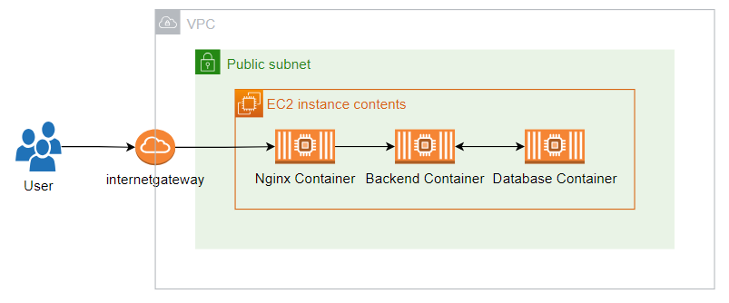

Project using Docker and EKS (K8S in AWS) to deploy

# Source

I am  using spring-postgres project in [awesome-compose](https://github.com/dockersamples/awesome-compose) repository as backend and frontend source code. But i customized this code to suit for my project.

# [Deploy to EC2](./EC2/README.md)

AWS EC2 is a service that allows you to create and manage virtual machines in the cloud. Docker Compose is a tool that helps you define and run multi-container applications using a YAML file. By combining these two technologies, you can easily launch your container system on AWS with minimal configuration.

About `docker-compose.yaml` file [Docker compose](./docker-compose/README.md)

Main components of the system are an EC2 instance deployed in a public subnet, which can be accessed directly through port 80. The traffic is then forwarded sequentially through an Nginx container, backend container, and database container.

About architect 

[More Detail about system](./EC2/README.md)

# [Deploy to EC2 combine with RDS and ALB](./EC2-ALB-RDS/README.md)

You can deploy your container system on AWS using some of its services: ALB, RDS, EC2. ALB is an application load balancer that distributes incoming traffic across multiple targets. RDS is a relational database service that provides scalable and secure data storage. EC2 is an elastic compute cloud that allows you to launch and manage virtual servers. By using these services, you can create a reliable and cost-effective container system on AWS.

[More Detail about system](./EC2-ALB-RDS/README.md)

# [Create ECR and push Docker image to AWS ECR](./ECR/README.md)

[Push to ECR](./ECR/README.md)

# [Deploy to ECS](./ECS-ALB-RDS/README.md)

You can deploy your container system on AWS using some of its services: ALB, RDS, EC2, ECS, ECR, and Secret Manager. ALB is an application load balancer that distributes traffic across your containers. RDS is a relational database service that provides scalable and secure data storage. ECS is a container orchestration service that manages the deployment and scaling of your containers. EC2 is a virtual machine service that runs your containers on the cloud. ECR is a container registry service that stores and manages your container images. Secret Manager is a service that helps you manage and protect database information.

[More Detail about system](./ECS-ALB-RDS/README.md)

# EKS Deploy